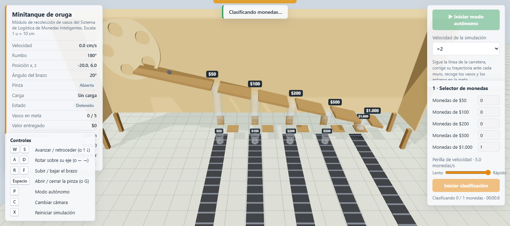
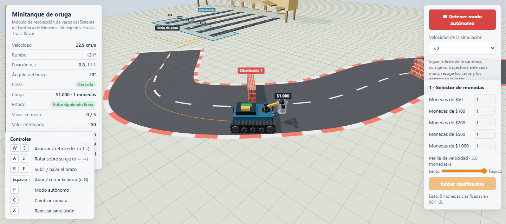
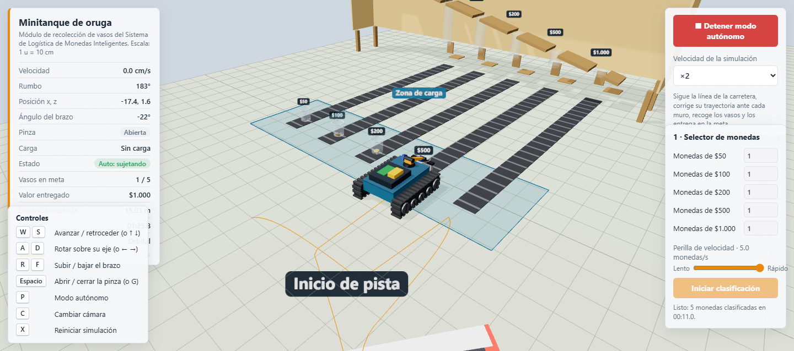
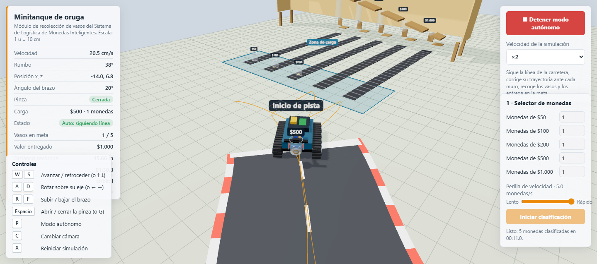
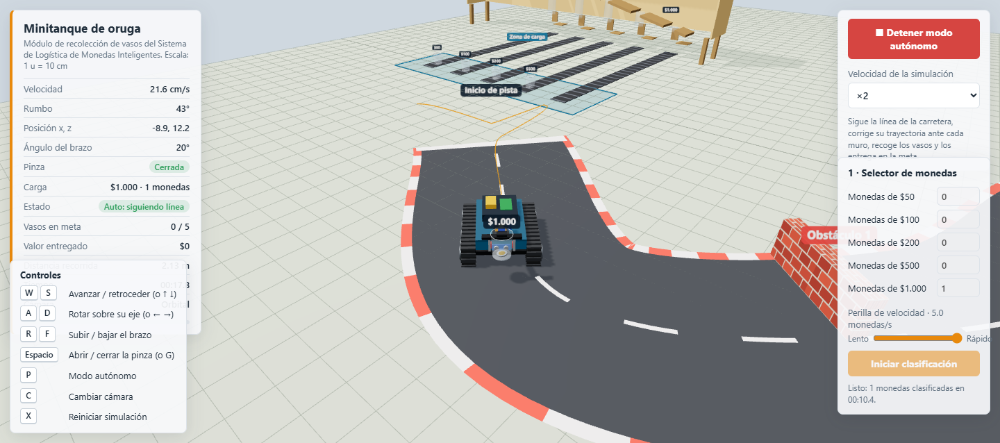
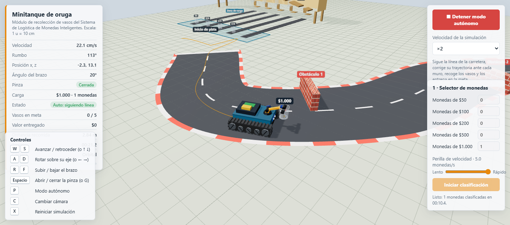
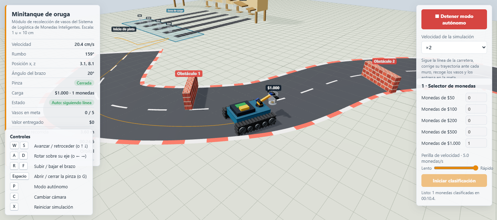
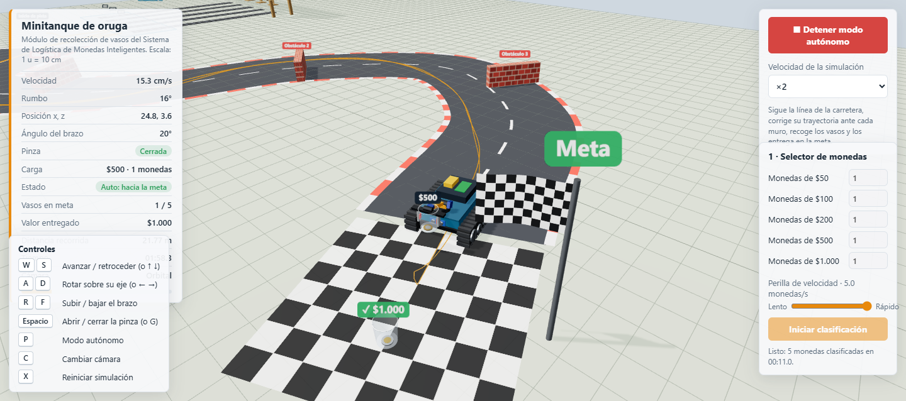
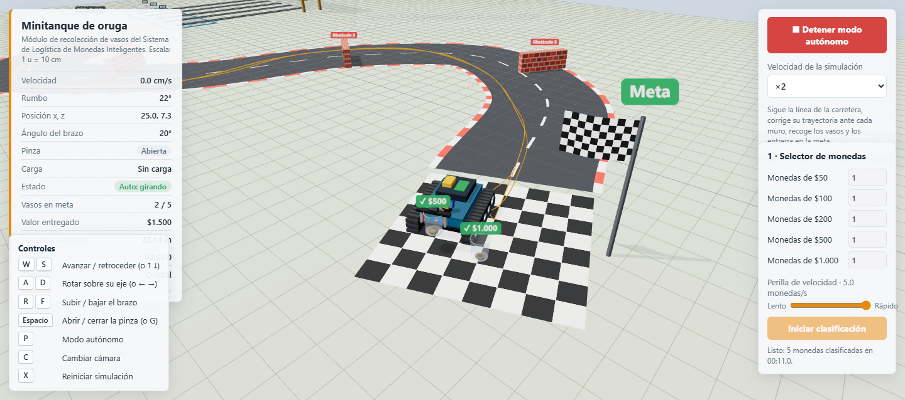
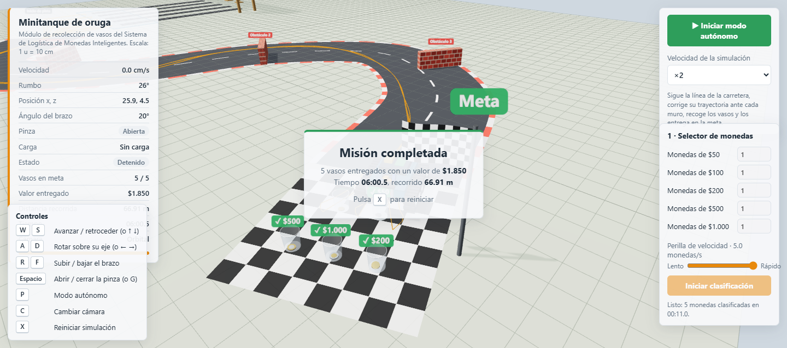

# Sistema de Logística Inteligente de Monedas

Propuesta de automatización para clasificar monedas colombianas, agruparlas en vasos y transportarlas hasta una meta con un minitanque de orugas equipado con brazo y pinza.

## Funcionamiento

1. **Clasificación:** se selecciona la cantidad de monedas de $50, $100, $200, $500 y $1.000 COP. El simulador representa su clasificación mediante un selector rotatorio, una rampa y canales separados.
2. **Empaque y transporte:** las monedas se agrupan en vasos por denominación. Al terminar la clasificación, los vasos pasan a la zona de carga mediante bandas transportadoras.
3. **Recolección autónoma:** el minitanque se aproxima a cada vaso, baja el brazo, cierra la pinza y recoge la carga.
4. **Recorrido:** sigue la pista hasta la meta y ajusta su trayectoria alrededor de los obstáculos. Después de entregar cada vaso, vuelve a recoger el siguiente.
5. **Entrega y registro:** en la meta, libera el vaso y actualiza el total de vasos y el valor entregado. La misión finaliza cuando los cinco vasos llegan a destino.

## Etapas de la simulación autónoma

### 1. Clasificación y zona de carga

### 2. Aproximación y sujeción

El minitanque se alinea con el vaso y utiliza la pinza para recogerlo.

### 3. Seguimiento de la pista y obstáculos

Con la carga asegurada, el minitanque recorre la pista y corrige su trayectoria en las curvas y cerca de los muros.

### 4. Llegada y entrega

Al llegar a la zona marcada, el minitanque libera el vaso y contabiliza su valor.

### 5. Misión completada

## Indicadores y controles

Durante la simulación, el panel muestra velocidad, rumbo, posición, estado del brazo y la pinza, carga, vasos entregados, valor acumulado, distancia y tiempo. El minitanque puede conducirse manualmente o mediante el modo autónomo; también se puede cambiar la cámara y la velocidad de simulación.

## Alcance

La escena HTML es una simulación 3D: las cantidades de monedas se seleccionan en pantalla y los movimientos del clasificador, las bandas y el minitanque son virtuales. No hay conexión con sensores ni actuadores físicos. El dashboard independiente y el chatbot por voz aparecen en la propuesta general del proyecto, pero no forman parte de esta simulación.
